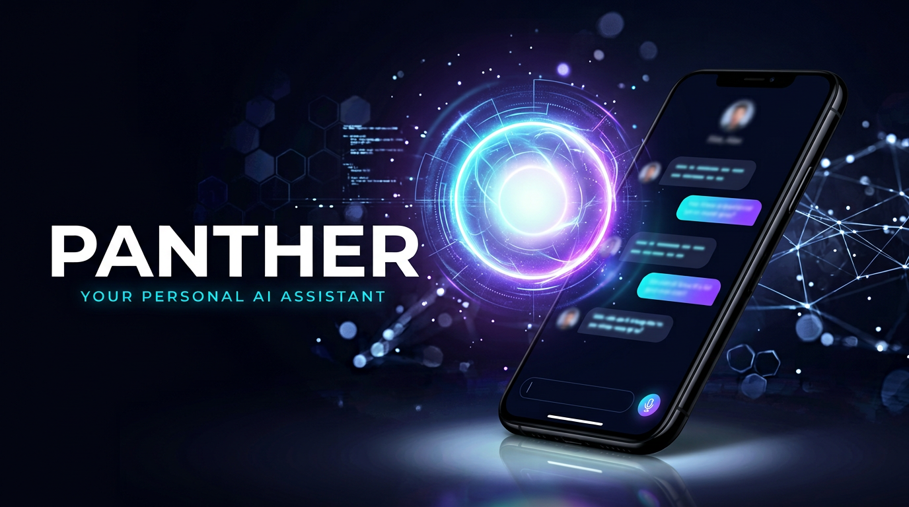

# 🐾 PANTHER — Aapka Personal AI Assistant (Android)

JARVIS-style AI voice assistant — **mobile ke liye**, Hinglish me baat karta hai,
naam hai **PANTHER**. Is repo me SARA/Jarvis web project ka concept liya gaya hai
aur usse ek real, native Android app (Kotlin + Jetpack Compose) banaya gaya hai.



> Ye folder poora **Android Studio project** hai. Yahan `Panther-Android/` ko
> Android Studio me kholo, API key daalo, aur **Run** dabao — app aapke phone /
> emulator pe chalegi. Neeche poora guide hai.

---

## ✨ Kya-kya kar sakta hai Panther (v1)

| Feature | Kaise |
|---|---|
| 🎙️ **Voice baat (speech→text)** | Mic dabao, bolo — live transcript + on-device recognition (hi-IN/en-IN) |
| 🔊 **Bolkar jawab (TTS)** | Hindi/Indian voice me Panther reply karta hai (agar installed ho) |
| 🤖 **Real AI baat-cheet** | OpenAI / Groq / Google Gemini / koi bhi OpenAI-compatible API |
| 🇮🇳 **Hinglish personality** | Chhota, witty, "Boss" bolne wala assistant — JARVIS jaisa |
| ⏰ Time / 📅 Date | Bina internet ke, turant |
| 🔋 Battery % | Real phone battery read karta hai |
| 🧮 Math solver | `2 + 2`, `128 × 45 = ?`, `(5+3)*2^4` — safe local parser |
| 😂 Jokes / 🪙 coin / 🎲 dice / 💪 motivation | Hinglish content, offline |
| 📸 **Apps kholna** | "open Instagram / WhatsApp / YouTube / Spotify / Telegram..." (installed apps launch, warna Play Store) |
| 🔍 **Google search** | "search karo ..." → browser |
| ▶️ **YouTube** | "YouTube pe ... chalao" → search results |
| 📍 **Google Maps** | "maps me ... dikha" → geo intent |
| 📞 **Call karo** | "call 98765 43210" → dialer |
| 🧭 "who made you" | → "Panther742 ne banaya" 🐾 |
| ⚙️ Settings | Provider, API key, model, base URL, "Always Listening", naam |

---

## 🛠️ Requirements (aapke computer pe)

1. **Android Studio** (koi bhi recent stable — Ladybug/Meerkat ya upar)
2. **JDK 17** (Android Studio ke andar bundled aata hai)
3. **Android SDK** — Android Studio install karte waqt auto aata hai
4. Ek **API key** (neeche dekho) — optional, sirf real AI chat ke liye

---

## 🚀 Build karne ke steps

### 1. Project kholo
- Android Studio → **File → Open** → is folder ko choose karo:
  `Panther-Android/`  (wo folder jisme `settings.gradle.kts` hai)
- Pehli baar Gradle sync me **2–10 minute** lag sakte hain (dependencies download).

### 2. (Optional) API key lo
Bina key ke bhi app chalegi — time/jokes/apps/local commands sab kaam karenge.
Real AI ke liye ek provider chuno:

| Provider | Key kahan se | Free? |
|---|---|---|
| **Google Gemini** | https://aistudio.google.com/apikey | ✅ free tier |
| **Groq** | https://console.groq.com/keys | ✅ free tier (fast!) |
| **OpenAI** | https://platform.openai.com/api-keys | 💳 paid |
| Custom (OpenRouter, Together, koi bhi OpenAI-compatible) | unki site | varies |

Key **app me** daali jaati hai: app kholo → ⚙️ (Settings) → provider chuno →
key paste karo → **Test Connection** → **Save**.
Key sirf aapke phone me (SharedPreferences) save hoti hai, kahin upload nahi hoti.

> 💡 **Model deprecation note:** Models time ke saath badalte hain. Agar
> "model nahi mila (404)" dikhe to Settings me model ka naam update karo —
> jaise Gemini ke liye AI Studio ka current model, ya `gpt-4o-mini` ke bajaye
> koi naya OpenAI model. Defaults: OpenAI `gpt-4o-mini`, Groq
> `llama-3.3-70b-versatile`, Gemini `gemini-2.0-flash`.

### 3. Run karo
- Apna phone **USB debugging** ON karke connect karo, ya emulator banao
- **Run ▶** (green play button) — app aapke device pe install ho jayegi
- APK banane ke liye: **Build → Build App Bundle(s) / APK(s) → Build APK(s)**
  → file milti hai `app/build/outputs/apk/debug/app-debug.apk`

---

## 🎤 Try karo (demo commands)

Pehli baar mic ka permission do (app khud mangega). Phir bolo ya type karo:

```
"hey Panther"
"time kya hua?"
"aaj kya date hai?"
"mujhe ek joke sunao"
"flip a coin"
"128 × 45 kya hai?"
"open Instagram"
"whatsapp kholo"
"search karo Chhava movie review"
"youtube pe Lata Mangeshkar songs chalao"
"maps me Surat railway station dikha"
"battery kitni hai?"
"call 98765 43210"
"AI kya hai?"            ← ye real AI se jaata hai (key chahiye)
```

Jawab **bolkar** bhi aata hai 🔊 aur chat me bubble ki tarah bhi dikhta hai.

---

## 🏗️ Project structure

```
Panther-Android/
├── app/src/main/java/com/panther742/panther/
│   ├── MainActivity.kt              ← App entry
│   ├── core/
│   │   ├── PantherViewModel.kt      ← Sab kuch jodta hai (state machine)
│   │   ├── PantherBrain.kt          ← OpenAI/Groq/Gemini streaming AI clients
│   │   ├── LocalBrain.kt            ← Offline skills + math parser + app launcher
│   │   ├── SpeechEngine.kt          ← Mic → text (on-device, hi-IN/en-IN)
│   │   ├── VoiceBox.kt              ← Text → speech (Hindi voice pick)
│   │   └── SettingsStore.kt         ← API settings (on-device only)
│   ├── model/Chat.kt                ← UI + chat data
│   └── ui/
│       ├── screens/PantherScreen.kt ← Orb, chat bubbles, composer (mobile-first)
│       ├── screens/SettingsPanel.kt ← Provider/key/model settings + test
│       └── theme/                   ← Panther dark theme + custom icons
└── app/src/main/res/                ← Launcher icon (Panther head 🐾), strings
```

---

## 🗺️ Roadmap (next steps — batado, main bana dunga)

- [ ] **Wake word** — "Hey Panther" background me sunna (foreground service + mic)
- [ ] **WhatsApp / Telegram message bhejna** (Accessibility service)
- [ ] **Real weather + news** (free API integration in settings)
- [ ] **Home screen widget** + notification quick-tile
- [ ] Smart home (lights/bulbs) via webhooks
- [ ] Play Store listing assets (icon screenshots, privacy policy)
- [ ] APK signing setup for release

---

## ❓ Troubleshooting

- **Mic permission allow karo** — Settings ⚙️ → Apps → Panther → Permissions
- **Speech recognition nahi chala** — Google app / "Speech Services by Google"
  installed hona chahiye (almost har phone pe hota hai). Type karke bhi baat kar sakte ho.
- **Voice reply Hindi me nahi** — phone pe Google TTS me Hindi voice download karo:
  Settings → Accessibility → Text-to-speech → Google TTS settings → Install voice data.
- **AI "Server 401"** — API key galat hai. **"Server 404"** — model naam galat/deprecated.
- **Gradle sync error** — Internet chahiye pehli baar; Android Studio ko SDK versions
  download karne do (File → Project Structure → SDK).

---

## ⚠️ Honest baatein

- Ye **v1** hai: wake word, cross-app actions aur smart-home baad ke versions me
  aayenge. "Always Listening" me battery zyada lagti hai — isliye default off hai.
- Kaunsa provider kaunsa model kitna charge karta hai — ye unki policies par hai.
- Panther aapka naam + apne creator ka naam "Panther742" jaanta hai 😉

**Boss, install karo aur bolo — "Panther, kya kar sakta hai tu?" 🐾**
